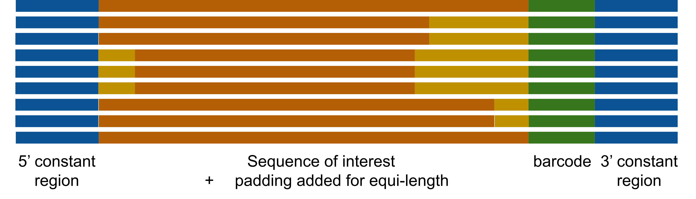
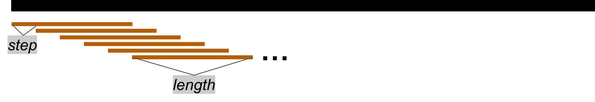
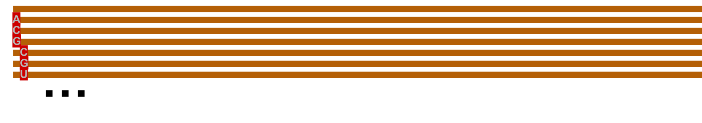
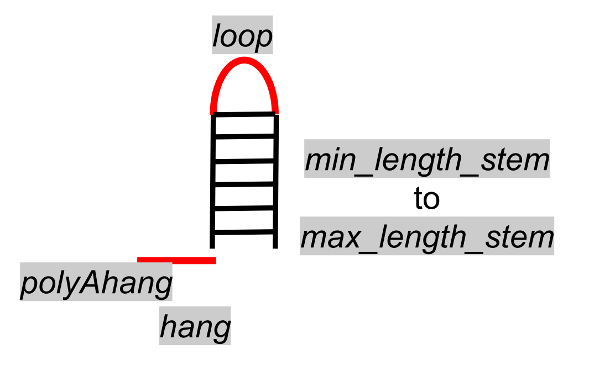
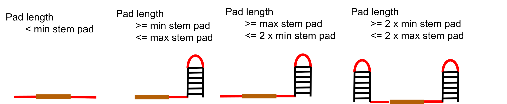
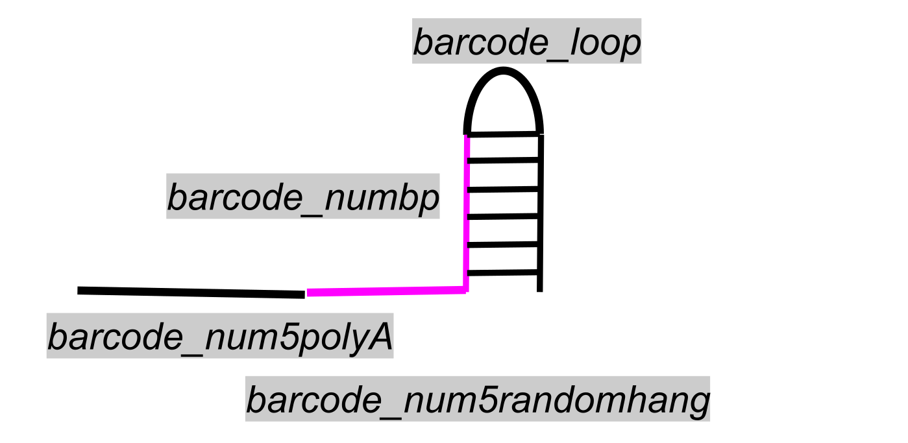
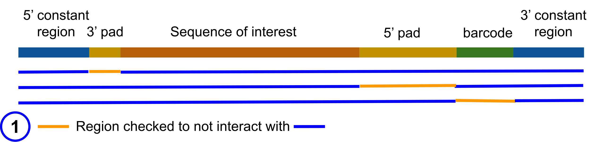
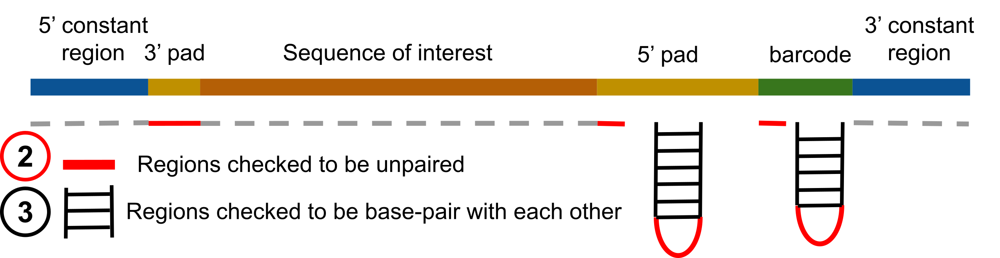

# Das Lab Library Design

A collection of functionalities for preparing library for RNA structure probing.


## This repository is currently under construction, please expect large changes to occur frequently while this message is here. Please submit [issues](https://github.com/DasLab/big_library_design/issues) or [pull requests](https://github.com/DasLab/big_library_design/pulls) for any bugs, thanks!


## About library design

### General library format



A library has the following features:
- A 5' and 3' constant region identical for all sequences can be specified with `--seq5` and `--seq3`.
- A 3' barcode region to uniquely identify the sequence
- A sequence of interest
- Optionally padding regions to make the length of the library uniform

Below we will focus on each of these features and the design decisions that can be made. Please note, the defaults are set to be generally applicable so not all options need to be set explicitly by the user.

[Sequences of interest](#sequences-of-interest)

[Padding](#padding)

[Barcoding](#barcoding)

[Structural checks](#structural-checks)


### Sequences of interest

There are many potential types of sequence sets that can be interesting to study. Below is the list of currently implemented options, please submit a [issue](https://github.com/DasLab/big_library_design/issues) for any desired features.

#### List of sequences

You can come with a list of sequences already prepared, see [library preparation below](#creating-library-from-already-prepared-sequence-list).

#### Windows of long sequences



Given a long sequence, or a set of long sequences, you can create windows of this sequence of a specified length. You can decide the following options:

- The size of each window, `--length`.
- The step between each window, `--step`.
- When reaching the end of the sequence, you can choose to circularize: attach the end (3') back to the (5'), using `--circularize`.
- Instead of the sequence given, you can use the reverse complement using `--reverse_complement`. We do not recommend having the sense and anti-sense in the same library as the likelihood that they would bind to each other is high.
- For infectious agents we advise never having the full genome in a single library, `--prop_windows_keep` or `--prop_windows_keep_random` can be used to reduce this safety concern, we recommend using two thirds or less.


You can find a full pipeline starting with window creation [below](#creating-library-of-sliding-windows).

#### All single mutations of sequence of interest



For mutate-map like experiments you can take a sequence and mutate all nucleotide to all possible other mutations. This results in 3 x sequence length mutations. You can do this for multiple sequences, but we advise padding the sequences so they are all the same length

You can find a full pipeline starting with single mutation creation [below](#creating-library-for-m2seq-all-single-mutants).

#### All double mutations across pairs of regions


We can also enumerate all possible double mutation (9 per nucleotide pair) between 2-regions. This results in 9 x length region A x length region B double mutants. The two regions can be specified using the `--doublemut` flag.

You can find a full pipeline starting with single mutation creation [below](#creating-library-with-all-single-mutants-and-select-double).


#### All rescue mutants of a list of base-pairs

While not scripted in any of our major functionality pipelines, this can be accomplished using [get_wcf_rescue_mutants](https://github.com/DasLab/big_library_design/blob/541410e4a3470ac0b5c9e86707f29e13af5f0502/utils/mutational_utils.py#L438).

### Padding

For experimental preparations of the library is it advantageous to have all sequences of interest be the same length. This can be accomplished by adding pads to the 5' and/or 3' ends of the sequence. Ideally these pads would not interact with each other, the sequence of interest, or any other part of the construct. While short single-stranded pads can be created, longer sequences should be sequestered in stem-loop to prevent interaction with the sequence of interest. Further, to reduce the probability of stacking of the pad helices with the sequence of interest it is advised to maintain a hang region which is single stranded. The following decisions can be made:

#### 1. Length of pad

By default all shorter sequences will be padded to the length of the longest sequence, but if you would like all sequences to be padded to a certain length this can be specified using `--pad_to_length`.

#### 2. Structure of pad

 


The structure of the pad is length dependent. If sufficiently long, as defined by the user, a stem will be formed, otherwise it will be all single stranded. The user can also specify a maximum length where a second stem is formed. Further, the user can specify the length of polyA and random sequence hangs as well as the loop sequence. The above diagram describes the parameters that can be changed.

See the `Structural checks` section to see how these structure constraints are enforced.

#### 3. Location of pad




The default behavior for pad location is length dependent, where preference is to have the pad on the 3' end, but when too short to form a stem-loop or too long for just one stem-loop it is shared between the 3' and 5' ends, as displayed in the diagram above. The case for where length is larger than 2 helices is not implemented, recommend just increasing the max_length_stem.

While not scripted in any of our major functionality, you can specify to have the pad only located at the 5' or 3' end of the sequence of interest using the `pad_side` argument in [add_pad](https://github.com/DasLab/big_library_design/blob/76e070065f1019ea755810c33c90f930b807dba8/utils/mutational_utils.py#L596) and [add_library_elements](https://github.com/DasLab/big_library_design/blob/76e070065f1019ea755810c33c90f930b807dba8/utils/mutational_utils.py#L1195C5-L1195C25).

#### 4. Sharing of pad sequence

Padding can be found for each sequence independently. Or the same pad can be used for all sequences of the same length. Finally, the same padding can be used for every sequences, and truncated as needed, we do not recommend this option as most length combination, it is extremely difficult to find a structurally sound pad for all lengths.


### Barcoding

#### 1. Structure of barcode

 


Similar to padding, the recommended barcode structure is a stem and a hang is also recommended to reduce the likelihood of helical stacking. The shape and length of the barcode can be specified with the parameters list in the figure above. Note only the random hang and base-pair region (pink) will be unique and hence encode the barcode. The polyA and loop have the same sequence, and the other side of the stem is complementary. Hence, the number of unique barcodes is 4^(numpbp + num5randomhang), this number is reduced significantly because some sequences do not fold correctly. Aiming to have at least 10x the number of possible barcodes than you library size is a reasonable rule of thumb.

 `--min_edit` can be used to define the minimum distance between any pair of barcodes, it is recommended to be at least 2 or 3. Note if you only have the stem barcoded, there is a minimum of 2 edit distance automatically, hence processing time will be faster.

#### 2. Number of barcodes

NOT YET IMPLEMENTED. As barcodes can potentially influence the behavior of your sequence, it can be important to have multiple replicates of each sequence of interest with multiple barcodes (and optionally multiple pads).

### Structural checks

The following structural checks aim to ensure the added sequences interfere with the sequence of interest during the experimental reactivity study.

#### 1. Padding and barcode are independently folded domains



We check that the 3' pad, 5' pad, and barcode do not interact with each other, the sequence of interest, or the constant regions.

#### 2. Padding and barcode fold as desired



We check that the 3' pad, 5' pad, and barcode all fold as requested. We check that hangs and loops are predicted to be unpaired and we check that the stems are predicted to form correctly.

#### More details

Sometimes, particularly with relatively unstructured regions of interest, the algorithm will fail to find a pad or barcode which is structurally sound. The protocol will then reduce the probability thresholds until it finds an answer. At a certain point, if there is a polyA region in the pad or barcode, it will start to mutate this as well. Warnings will be printed to notify the user of these changes. 

It should be noted that we never check whether the sequence of interest interact with the 5' or 3' constant region because neither of these regions can be mutated to fix the issue. These interactions can be predicted and will show up in the base pair probability matrices.


### Final library

The final library can be written out in a variety of formats required by various synthesis companies including a fasta, csv, and txt file. Please submit an [issue](https://github.com/DasLab/big_library_design/issues) for any synthesis company preferred format that is not currently implemented.

## Example functionalities

Major functionalities have been scripted in `prepare_library.py`. Please see `python prepare_library.py -h` for details on the options and example runs below. Note these scripted functionalities are a subset of what is possible with the code base. Please submit an [issue](https://github.com/DasLab/big_library_design/issues) if you want an additional library preparation method to be added to this main script.

```
usage: prepare_library.py [-h] -i INPUT_FASTA -o OUTPUT_PREFIX [--check_library | --just_library | --window | --m2seq | --m2seq_with_double]
                          [--save_bpp_fig SAVE_BPP_FIG] [--save_image_folder SAVE_IMAGE_FOLDER] [--max_seq_punpaired_plot MAX_SEQ_PUNPAIRED_PLOT]
                          [--Pmax_noninteract PMAX_NONINTERACT] [--Pmin_paired PMIN_PAIRED] [--Pavg_paired PAVG_PAIRED] [--Pmin_unpaired PMIN_UNPAIRED]
                          [--Pavg_unpaired PAVG_UNPAIRED] [--seq5 SEQ5] [--seq3 SEQ3] [--barcode_numbp BARCODE_NUMBP] [--barcode_num5polyA BARCODE_NUM5POLYA]
                          [--barcode_num5randomhang BARCODE_NUM5RANDOMHANG] [--barcode_loop BARCODE_LOOP] [--num_barcodes_reduce_prob NUM_BARCODES_REDUCE_PROB]
                          [--avoid_barcodes_files AVOID_BARCODES_FILES [AVOID_BARCODES_FILES ...]] [--avoid_barcodes_start AVOID_BARCODES_START]
                          [--avoid_barcodes_end AVOID_BARCODES_END] [--min_edit MIN_EDIT] [--length LENGTH] [--step STEP] [--circularize] [--reverse_complement]
                          [--prop_windows_keep PROP_WINDOWS_KEEP] [--prop_windows_keep_random PROP_WINDOWS_KEEP_RANDOM] [--share_pad SHARE_PAD]
                          [--pad_loop PAD_LOOP] [--pad_hang PAD_HANG] [--pad_num_samples PAD_NUM_SAMPLES] [--pad_to_length PAD_TO_LENGTH]
                          [--doublemut DOUBLEMUT [DOUBLEMUT ...]]

optional arguments:
  -h, --help            show this help message and exit

Required:
  -i INPUT_FASTA, --input_fasta INPUT_FASTA
                        Sequences to make library out of, file in fasta format. (default: None)
  -o OUTPUT_PREFIX, --output_prefix OUTPUT_PREFIX
                        Prefix of the output files. (default: None)

programs:
  --check_library       The check_libary program will take one fasta and make sure it is ready for submission, reporting any problems. (default: False)
  --just_library        The just_libary program will take all sequences provided and then just prepare the library using only those sequences. (default: False)
  --window              The window program will take each sequence, create sliding windows and then prepare the library sequences. (default: False)
  --m2seq               The m2seq program will take each sequence, get all single mutants, create a non-interacting pad to ensure each sequence is the same length
                        if needed, and then prepare the library sequences. (default: False)
  --m2seq_with_double   The program runs the m2seq program with the addition of double mutants in user defined regions. (default: False)

Visuals:
  --save_bpp_fig SAVE_BPP_FIG
                        Proportion to save images of the base-pair-probability matrices. 0 is none, 1 is all, in between is random selection of sequences.
                        (default: 0)
  --save_image_folder SAVE_IMAGE_FOLDER
                        Folder to save images (probability unpaired and if specified base-pair-probability matrices), default don't save. (default: None)
  --max_seq_punpaired_plot MAX_SEQ_PUNPAIRED_PLOT
                        The maximum number of sequences to put in one probability unpaired plot, will split into separate images if smaller than total number of
                        sequences. (default: 500)

Structural checks:
  --Pmax_noninteract PMAX_NONINTERACT
                        Maximum base-pair-probability for 2 regions to be considered non-interacting. (default: 0.05)
  --Pmin_paired PMIN_PAIRED
                        Minimum base-pair-probability for 2 regions to be considered paired. (default: 0.75)
  --Pavg_paired PAVG_PAIRED
                        Average base-pair-probability for 2 regions to be considered paired. (default: 0.85)
  --Pmin_unpaired PMIN_UNPAIRED
                        Minimum probability unpaired for region to be unpaired. (default: 0.75)
  --Pavg_unpaired PAVG_UNPAIRED
                        Average probability unpaired for region to be unpaired. (default: 0.85)

Library parts:
  --seq5 SEQ5           Constant sequence to place at 5' of every sequence in library. (default: GGGAACGACTCGAGTAGAGTCGAAAA)
  --seq3 SEQ3           Constant sequence to place at 3' of every sequence in library. (default: AAAAGAAACAACAACAACAAC)
  --barcode_numbp BARCODE_NUMBP
                        The length (in bp) of the random barcode stem. (default: 8)
  --barcode_num5polyA BARCODE_NUM5POLYA
                        The length of polyA stretch placed before the barcode stem, if specified, also put before the random 5'hang.. (default: 4)
  --barcode_num5randomhang BARCODE_NUM5RANDOMHANG
                        The length of additional random (single-standed) sequence to place before the barcode stem. (default: 0)
  --barcode_loop BARCODE_LOOP
                        Constant loop sequence of the barcode stem-loop. (default: TTCG)
  --num_barcodes_reduce_prob NUM_BARCODES_REDUCE_PROB
                        Number of barcodes to try before reducing probability thresholds by 10 percent. (default: 100)
  --avoid_barcodes_files AVOID_BARCODES_FILES [AVOID_BARCODES_FILES ...]
                        Fasta files which contains sequences with barcodes to remove. (default: None)
  --avoid_barcodes_start AVOID_BARCODES_START
                        First nucleotide in barcode. (default: None)
  --avoid_barcodes_end AVOID_BARCODES_END
                        Last nucleotide in barcode. (default: None)
  --min_edit MIN_EDIT   Minimum edit distance for barcodes (2 or 3 should suffice. (default: 2)

window:
  --length LENGTH       Length of each window to create. (default: 100)
  --step STEP           The step size of the sliding window. (default: 10)
  --circularize         Whether to circularize the sequence (at 3' end, don't stop but loop back to 5') or not. (default: False)
  --reverse_complement  Whether to use the negative sense strand instead. (default: False)
  --prop_windows_keep PROP_WINDOWS_KEEP
                        The proportion of windows to keep (from the start), others not added to library. (default: 1.0)
  --prop_windows_keep_random PROP_WINDOWS_KEEP_RANDOM
                        The proportion of windows to keep (randomly selected), others not added to library. (default: 1.0)

padding for: m2seq or just_library when length not equal:
  --share_pad SHARE_PAD
                        If there are sequences of multiple lengths, to obtain a library of equal length some sequences will be padded. This specifies which
                        sequence share the same pad, all, none or same_length sequences. (default: same_length)
  --pad_loop PAD_LOOP   If pad has stem the constant loop to use. (default: TTCG)
  --pad_hang PAD_HANG   Number nucleotides (only +1 possible) to have a random, single-stranded hang between sequence of interest and pad. (default: 3)
  --pad_num_samples PAD_NUM_SAMPLES
                        Minimum number of sequences to check pad's effect on structure. (default: 30)
  --pad_to_length PAD_TO_LENGTH
                        Length of sequence to pad to, if nothing, longest length in fasta file. (default: None)

double mutant:
  --doublemut DOUBLEMUT [DOUBLEMUT ...]
                        Two region to do double mutants of (one mutant in group A one in group B) format: 1-12,15.64-70,72-78 where this would mean one mutant in
                        nucleotides 1 to 12 (inclusive) or 15 and one mutant in region 64 to 70 or 72 to 78. 1-12.1-12 would mean all double mutants in 1to 12. If
                        more than one sequence is in the input need to specify the same number of regions separated by space eg for 2 sequences:
                        1-12,15.64-70,72-78 34-78.80-85 (default: None)


```

### Creating library from already prepared sequence list

```
python prepare_library.py --just_library -i examples/example_WT.fasta -o examples/just_library_ex_output/example --save_bpp_fig 1 --save_image_folder examples/just_library_ex_output/figs/
```

Example output is in `examples/just_library_ex_output`, note you should not expect to see same padding or barcodes as these are randomly generated. 

### Creating library of sliding windows

```
python prepare_library.py --window -i examples/example_WT.fasta -o examples/window_ex_output/example --length 100 --step 10 --Pmax_noninteract 0.15 --prop_windows_keep 0.6667 --save_bpp_fig 1 --save_image_folder examples/window_ex_output/figs/ --max_seq_punpaired_plot 20
```

Example output is in `examples/window_ex_output`, note you should not expect exact same sequences as barcodes are randomly generated. Only 1 example base-pair-probability matrix figure uploaded to this github, but this call will generate one for all sequences.

### Creating library for M2Seq (all single-mutants)

```
python prepare_library.py --m2seq -i examples/example_WT.fasta -o examples/m2seq_ex_output/example --Pmax_noninteract 0.15 --Pmin_paired 0.7 --Pavg_paired 0.8 --Pmin_unpaired 0.6 --Pmin_unpaired 0.8 --save_bpp_fig 1 --save_image_folder examples/m2seq_ex_output/figs/
```

Example output is in `examples/m2seq_ex_output`, note you should expect to see the same mutants in the region of interest, but you should not expect to see same pads or barcodes. Only 1 example base-pair-probability matrix figure is uploaded to this github, but this call will generate one for every sequence in the libaray.

### Creating library with all single-mutants and select double

```
python prepare_library.py --m2seq_with_double -i examples/example_WT.fasta -o examples/double_ex_output/example --Pmax_noninteract 0.15 --Pmin_paired 0.7 --Pavg_paired 0.8 --Pmin_unpaired 0.6 --Pmin_unpaired 0.8 --doublemut 20-23.24-28 56.82,90 130,140.150-151 --save_bpp_fig 1 --save_image_folder examples/double_ex_output/figs/
```

Example output is in `examples/double_ex_output`, note you should expect to see the same mutants in the region of interest, but you should not expect to see same pads or barcodes. Only 1 example base-pair-probability matrix figure is uploaded to this github, but this call will generate one for every sequence in the libaray.
